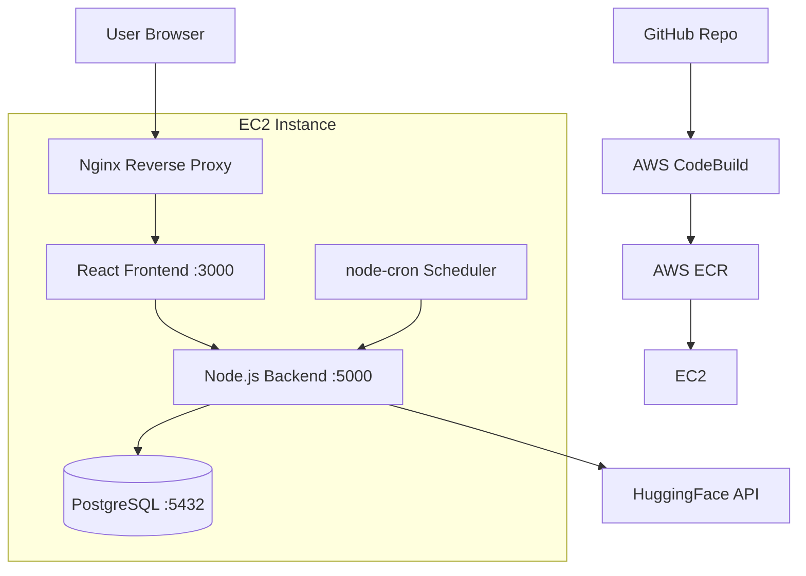

# Auto-Generated Blog - Complete Project Roadmap

## 🎯 Project Overview

Build and deploy a full-stack auto-generated blog application using React, Node.js, PostgreSQL, Docker, and AWS (EC2, ECR, CodeBuild).

**Timeline:** 1 week  
**Budget:** Free tier AWS + max $5 for AI (or use free AI APIs)

---

## 📋 Architecture Decisions

### Technology Stack

| Component | Technology | Rationale |
|-----------|-----------|-----------|
| **Frontend** | React 18 + Vite | Fast development, modern tooling, easy to Dockerize |
| **Backend** | Node.js + Express | Simple, widely supported, excellent for REST APIs |
| **Database** | PostgreSQL | Robust, free tier on EC2, production-ready |
| **AI Service** | HuggingFace Inference API | **FREE**, no API key needed, good quality |
| **Scheduling** | node-cron | Built into Node.js, no external dependencies |
| **Containerization** | Docker + Docker Compose | Industry standard, required by challenge |
| **CI/CD** | AWS CodeBuild | Required by challenge, integrates with ECR |
| **Hosting** | AWS EC2 (t2.micro) | Free tier eligible, required by challenge |
| **Registry** | AWS ECR | Required by challenge, stores Docker images |

### System Architecture



---

## 🚀 Phase 1: Initial Setup (Day 1 - Morning)

### Step 1.1: Create Project Structure

```bash
# Create main project directory
mkdir auto-blog && cd auto-blog

# Initialize Git
git init

# Create folder structure
mkdir -p backend/src/{routes,services,models,config}
mkdir -p frontend/src/{components,pages,api,styles}
mkdir -p infra/scripts
mkdir -p docs

# Create initial files
touch backend/Dockerfile backend/package.json backend/.dockerignore
touch frontend/Dockerfile frontend/package.json frontend/.dockerignore
touch docker-compose.yml .gitignore README.md
touch infra/buildspec.yml
```

### Step 1.2: Initialize Git Repository

Create `.gitignore`:
```
node_modules/
.env
.env.local
dist/
build/
*.log
.DS_Store
```

### Step 1.3: Set Up GitHub Repository

```bash
# Create repo on GitHub (via web interface)
# Then connect local repo
git remote add origin https://github.com/YOUR_USERNAME/auto-blog.git
git add .
git commit -m "Initial project structure"
git push -u origin main
```

---

## 🔧 Phase 2: Backend Development (Day 1 - Afternoon + Day 2)

### Step 2.1: Initialize Node.js Backend

**File: `backend/package.json`**
```json
{
  "name": "auto-blog-backend",
  "version": "1.0.0",
  "type": "module",
  "scripts": {
    "dev": "nodemon src/index.js",
    "start": "node src/index.js"
  },
  "dependencies": {
    "express": "^4.18.2",
    "cors": "^2.8.5",
    "pg": "^8.11.3",
    "dotenv": "^16.3.1",
    "node-cron": "^3.0.3",
    "axios": "^1.6.2"
  },
  "devDependencies": {
    "nodemon": "^3.0.2"
  }
}
```

### Step 2.2: Database Schema

**File: `backend/src/config/database.sql`**
```sql
CREATE TABLE articles (
  id SERIAL PRIMARY KEY,
  title VARCHAR(255) NOT NULL,
  content TEXT NOT NULL,
  summary TEXT,
  created_at TIMESTAMP DEFAULT CURRENT_TIMESTAMP,
  updated_at TIMESTAMP DEFAULT CURRENT_TIMESTAMP
);

CREATE INDEX idx_articles_created_at ON articles(created_at DESC);
```

### Step 2.3: Core Backend Files

**File: `backend/src/config/db.js`**
- PostgreSQL connection pool
- Database initialization

**File: `backend/src/services/aiClient.js`**
- HuggingFace API integration
- Article generation logic
- Prompt engineering for blog posts

**File: `backend/src/services/articleJob.js`**
- node-cron scheduler (runs daily at 2 AM)
- Calls AI service to generate article
- Saves to database

**File: `backend/src/routes/articles.js`**
- `GET /api/articles` - List all articles
- `GET /api/articles/:id` - Get single article
- `POST /api/articles/generate` - Manual generation (for testing)

**File: `backend/src/index.js`**
- Express app setup
- CORS configuration
- Routes registration
- Start cron job
- Server initialization

### Step 2.4: Backend Dockerfile

**File: `backend/Dockerfile`**
```dockerfile
FROM node:18-alpine

WORKDIR /app

COPY package*.json ./
RUN npm ci --only=production

COPY . .

EXPOSE 5000

CMD ["node", "src/index.js"]
```

### Step 2.5: Environment Variables

**File: `backend/.env.example`**
```
PORT=5000
DATABASE_URL=postgresql://user:password@db:5432/autoblog
NODE_ENV=production
HUGGINGFACE_API_URL=https://api-inference.huggingface.co/models/gpt2
```

---

## 🎨 Phase 3: Frontend Development (Day 2 - Afternoon + Day 3)

### Step 3.1: Initialize React App

```bash
cd frontend
npm create vite@latest . -- --template react
npm install axios react-router-dom
```

### Step 3.2: Frontend Structure

**File: `frontend/src/api/client.js`**
- Axios instance with base URL
- API methods: `getArticles()`, `getArticle(id)`

**File: `frontend/src/pages/HomePage.jsx`**
- Display list of articles
- Show title, summary, date
- Link to article detail

**File: `frontend/src/pages/ArticlePage.jsx`**
- Display full article content
- Back button to list

**File: `frontend/src/components/ArticleCard.jsx`**
- Reusable article preview component

**File: `frontend/src/App.jsx`**
- React Router setup
- Routes configuration

### Step 3.3: Styling Approach

Use **CSS Modules** or **Tailwind CSS** for clean, modern design:
- Responsive layout
- Card-based article list
- Clean typography
- Loading states
- Error handling

### Step 3.4: Frontend Dockerfile

**File: `frontend/Dockerfile`**
```dockerfile
FROM node:18-alpine AS build

WORKDIR /app
COPY package*.json ./
RUN npm ci
COPY . .
RUN npm run build

FROM nginx:alpine
COPY --from=build /app/dist /usr/share/nginx/html
COPY nginx.conf /etc/nginx/conf.d/default.conf
EXPOSE 80
CMD ["nginx", "-g", "daemon off;"]
```

**File: `frontend/nginx.conf`**
```nginx
server {
    listen 80;
    location / {
        root /usr/share/nginx/html;
        index index.html;
        try_files $uri $uri/ /index.html;
    }
    location /api {
        proxy_pass http://backend:5000;
    }
}
```

---

## 🐳 Phase 4: Local Development Setup (Day 3)

### Step 4.1: Docker Compose

**File: `docker-compose.yml`**
```yaml
version: '3.8'

services:
  db:
    image: postgres:15-alpine
    environment:
      POSTGRES_USER: bloguser
      POSTGRES_PASSWORD: blogpass
      POSTGRES_DB: autoblog
    volumes:
      - postgres_data:/var/lib/postgresql/data
      - ./backend/src/config/database.sql:/docker-entrypoint-initdb.d/init.sql
    ports:
      - "5432:5432"

  backend:
    build: ./backend
    ports:
      - "5000:5000"
    environment:
      DATABASE_URL: postgresql://bloguser:blogpass@db:5432/autoblog
      PORT: 5000
    depends_on:
      - db
    volumes:
      - ./backend:/app
      - /app/node_modules

  frontend:
    build: ./frontend
    ports:
      - "3000:80"
    depends_on:
      - backend

volumes:
  postgres_data:
```

### Step 4.2: Local Testing Commands

```bash
# Start all services
docker-compose up --build

# View logs
docker-compose logs -f backend

# Stop services
docker-compose down

# Reset database
docker-compose down -v
```

---

## ☁️ Phase 5: AWS Infrastructure Setup (Day 4)

### Step 5.1: AWS Account Setup

1. Create AWS account or sign in
2. Verify free tier eligibility
3. Set up billing alerts ($5 threshold)

### Step 5.2: Create ECR Repositories

```bash
# Install AWS CLI
brew install awscli  # macOS

# Configure AWS CLI
aws configure

# Create ECR repositories
aws ecr create-repository --repository-name auto-blog-frontend
aws ecr create-repository --repository-name auto-blog-backend
```

### Step 5.3: Launch EC2 Instance

**Instance Configuration:**
- **AMI:** Amazon Linux 2023
- **Instance Type:** t2.micro (free tier)
- **Storage:** 20 GB gp3
- **Security Group:**
  - SSH (22) - Your IP only
  - HTTP (80) - 0.0.0.0/0
  - Custom TCP (5000) - 0.0.0.0/0
  - Custom TCP (3000) - 0.0.0.0/0

**User Data Script:**
```bash
#!/bin/bash
yum update -y
yum install -y docker
systemctl start docker
systemctl enable docker
usermod -a -G docker ec2-user

# Install Docker Compose
curl -L "https://github.com/docker/compose/releases/latest/download/docker-compose-$(uname -s)-$(uname -m)" -o /usr/local/bin/docker-compose
chmod +x /usr/local/bin/docker-compose

# Install PostgreSQL client
yum install -y postgresql15
```

### Step 5.4: Create IAM Roles

**CodeBuild Service Role:**
- Permissions: ECR push, S3 access, CloudWatch logs

**EC2 Instance Role:**
- Permissions: ECR pull

---

## 🔄 Phase 6: CI/CD Pipeline (Day 5)

### Step 6.1: CodeBuild Configuration

**File: `infra/buildspec.yml`**
```yaml
version: 0.2

phases:
  pre_build:
    commands:
      - echo Logging in to Amazon ECR...
      - aws ecr get-login-password --region $AWS_REGION | docker login --username AWS --password-stdin $ECR_REGISTRY
      
  build:
    commands:
      - echo Building Docker images...
      - docker build -t auto-blog-backend:latest ./backend
      - docker build -t auto-blog-frontend:latest ./frontend
      - docker tag auto-blog-backend:latest $ECR_REGISTRY/auto-blog-backend:latest
      - docker tag auto-blog-frontend:latest $ECR_REGISTRY/auto-blog-frontend:latest
      
  post_build:
    commands:
      - echo Pushing images to ECR...
      - docker push $ECR_REGISTRY/auto-blog-backend:latest
      - docker push $ECR_REGISTRY/auto-blog-frontend:latest
      - echo Build completed on `date`
```

### Step 6.2: Create CodeBuild Project

1. Go to AWS CodeBuild console
2. Create new project
3. Source: GitHub repository
4. Environment: Ubuntu, Standard runtime
5. Buildspec: Use `infra/buildspec.yml`
6. Set environment variables:
   - `AWS_REGION`
   - `ECR_REGISTRY`

### Step 6.3: EC2 Deployment Script

**File: `infra/scripts/deploy.sh`**
```bash
#!/bin/bash

# Login to ECR
aws ecr get-login-password --region us-east-1 | docker login --username AWS --password-stdin YOUR_ECR_REGISTRY

# Pull latest images
docker pull YOUR_ECR_REGISTRY/auto-blog-backend:latest
docker pull YOUR_ECR_REGISTRY/auto-blog-frontend:latest

# Stop existing containers
docker-compose down

# Start new containers
docker-compose up -d

echo "Deployment complete!"
```

---

## 🚀 Phase 7: Deployment & Testing (Day 6)

### Step 7.1: Initial Deployment

```bash
# SSH into EC2
ssh -i your-key.pem ec2-user@YOUR_EC2_IP

# Clone repository
git clone https://github.com/YOUR_USERNAME/auto-blog.git
cd auto-blog

# Create .env file
nano backend/.env

# Run deployment script
chmod +x infra/scripts/deploy.sh
./infra/scripts/deploy.sh
```

### Step 7.2: Initialize Database

```bash
# Connect to PostgreSQL container
docker exec -it auto-blog-db-1 psql -U bloguser -d autoblog

# Verify schema
\dt

# Generate initial articles
curl -X POST http://localhost:5000/api/articles/generate
curl -X POST http://localhost:5000/api/articles/generate
curl -X POST http://localhost:5000/api/articles/generate
```

### Step 7.3: Verify Application

- Frontend: `http://YOUR_EC2_IP:3000`
- Backend: `http://YOUR_EC2_IP:5000/api/articles`
- Check cron job logs: `docker logs auto-blog-backend-1`

---

## 📝 Phase 8: Documentation & Submission (Day 7)

### Step 8.1: Update README

**File: `README.md`**

Include:
- Project overview
- Architecture diagram
- Local setup instructions
- Deployment guide
- API documentation
- Environment variables
- Troubleshooting

### Step 8.2: Create Architecture Documentation

**File: `docs/ARCHITECTURE.md`**

Document:
- System design decisions
- Database schema
- API endpoints
- AI integration approach
- Deployment workflow
- Security considerations

### Step 8.3: Record Video (30-120 seconds)

**Script outline:**
1. **Introduction (10s):** "Hi, I'm [Name], and I built this auto-generated blog for the technical challenge."
2. **Demo (30s):** Show the live application, article list, and detail view
3. **Technical Decisions (40s):**
   - "I used HuggingFace's free API to avoid costs"
   - "PostgreSQL for reliability"
   - "Docker Compose for easy deployment"
   - "CodeBuild automates the build pipeline"
4. **Improvements (20s):**
   - "With more time, I'd add user authentication"
   - "Implement article categories and tags"
   - "Add CloudWatch monitoring"
5. **Closing (10s):** "Thank you for reviewing my submission!"

### Step 8.4: Final Submission Checklist

- [ ] Live URL is accessible
- [ ] GitHub repo is public
- [ ] README is comprehensive
- [ ] Video is uploaded and accessible
- [ ] Email drafted with all three items
- [ ] Send to hiring@assimetria.com

---

## 🛠️ Recommended Tools & Resources

### Development Tools
- **VS Code** with extensions: Docker, ESLint, Prettier
- **Postman** or **Thunder Client** for API testing
- **Docker Desktop** for local development
- **AWS CLI** for infrastructure management

### AI API Resources
- [HuggingFace Inference API](https://huggingface.co/docs/api-inference/index)
- Free models: `gpt2`, `distilgpt2`, `facebook/opt-350m`

### AWS Documentation
- [ECR User Guide](https://docs.aws.amazon.com/ecr/)
- [CodeBuild User Guide](https://docs.aws.amazon.com/codebuild/)
- [EC2 User Guide](https://docs.aws.amazon.com/ec2/)

---

## ⚠️ Common Pitfalls to Avoid

1. **Don't use ECS** - Challenge specifically requires EC2
2. **Free tier limits** - Monitor usage to stay within free tier
3. **Security groups** - Don't expose PostgreSQL port publicly
4. **Environment variables** - Never commit `.env` files
5. **Docker image size** - Use multi-stage builds and alpine images
6. **Cron timezone** - EC2 uses UTC by default
7. **CORS issues** - Configure properly for frontend-backend communication

---

## 🎯 Success Criteria

✅ Application is live and accessible  
✅ At least 3 articles are pre-generated  
✅ New article generates daily automatically  
✅ Frontend displays articles correctly  
✅ Backend API works as expected  
✅ Docker images in ECR  
✅ CodeBuild pipeline functional  
✅ Clean, documented code  
✅ Professional video submission  

---

## 📞 Next Steps

**Start NOW with Phase 1:**

```bash
mkdir -p backend/src/{routes,services,models,config}
mkdir -p frontend/src/{components,pages,api,styles}
mkdir -p infra/scripts docs
```

Then proceed systematically through each phase. You've got this! 🚀
